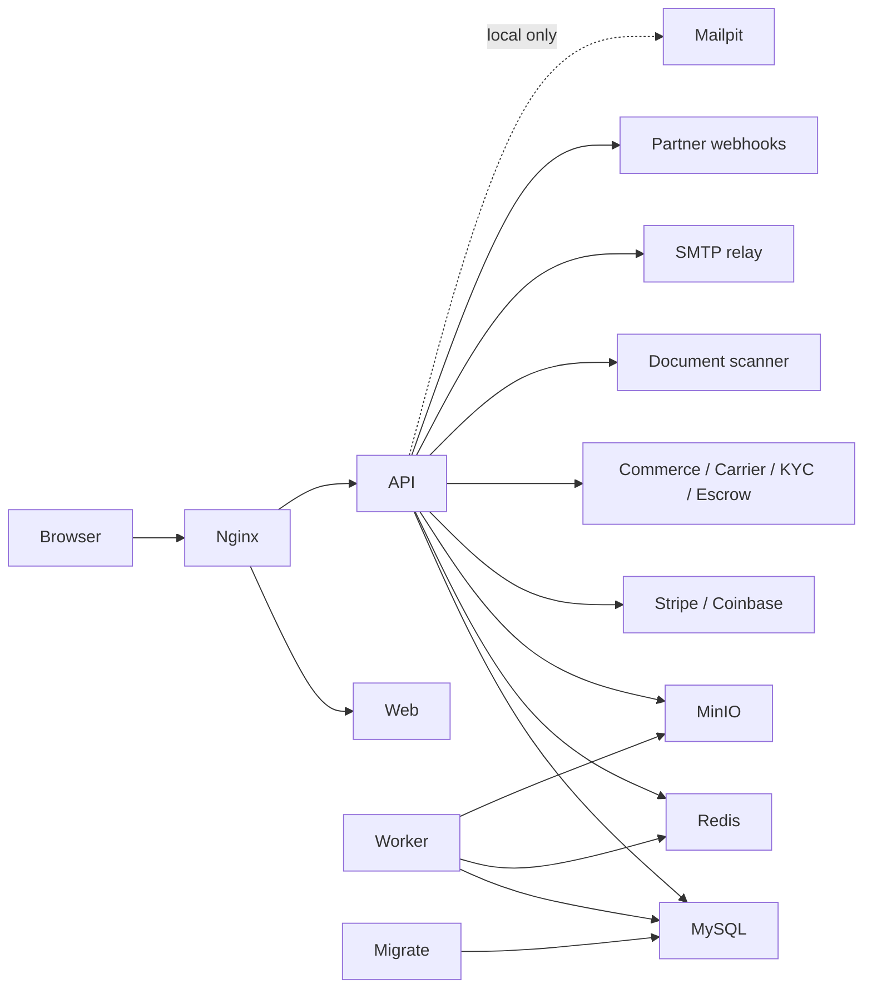

# Container architecture

The core stack contains `web`, `api`, `worker`, `migrate`, MySQL, Redis, MinIO,
Mailpit, and Nginx. Only Nginx is intended to be public in production. The API
and worker share application modules but run as independent processes. The
migration job must succeed before API and worker startup.

`compose.yaml` defines the secure core topology. `compose.dev.yaml` exposes
developer ports for MySQL, Redis, MinIO, and Mailpit. `compose.prod.yaml` applies
production environment flags and resource limits but is not a complete
production orchestrator. Secrets, TLS termination, backups, scheduling,
autoscaling, and multi-host recovery remain deployment decisions.

`PAYMENT_ADAPTER=mock` is permitted only in development and test; API startup
fails in production when it is selected. The same fail-closed rule applies to
preview/deterministic commerce, carrier, KYC, C2C escrow, scanner, and mail
adapters. Mailpit remains local-only; production uses authenticated mandatory-TLS
SMTP. MinIO provides the local S3-compatible boundary for freight documents and
proof of delivery, while production requires HTTPS public object access and a
scanner that attests the storage-verified digest.
