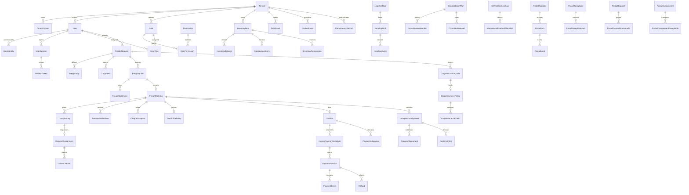

# Core entity relationship diagram

This is a deliberately compact relationship map. The Prisma schema is
authoritative for optionality, indexes, revision links, legacy invoice
compatibility, carrier/driver/vehicle ownership, document metadata, journal
postings, and every other implemented domain.
