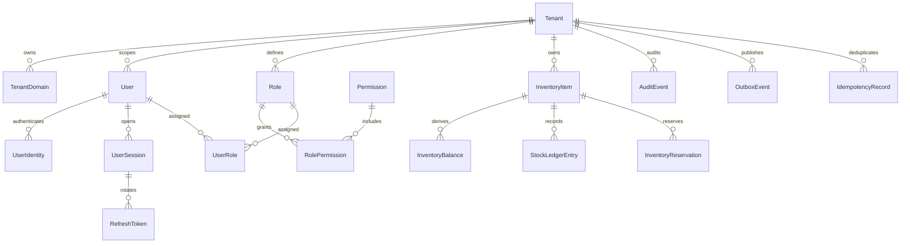

# Foundation entity relationship diagram

```mermaid
erDiagram
  Tenant ||--o{ TenantDomain : owns
  Tenant ||--o{ User : scopes
  User ||--o{ UserIdentity : authenticates
  User ||--o{ UserSession : opens
  UserSession ||--o{ RefreshToken : rotates
  Tenant ||--o{ Role : defines
  Role ||--o{ RolePermission : grants
  Permission ||--o{ RolePermission : includes
  User ||--o{ UserRole : assigned
  Role ||--o{ UserRole : assigned
  Tenant ||--o{ InventoryItem : owns
  InventoryItem ||--o{ InventoryBalance : derives
  InventoryItem ||--o{ StockLedgerEntry : records
  InventoryItem ||--o{ InventoryReservation : reserves
  Tenant ||--o{ AuditEvent : audits
  Tenant ||--o{ OutboxEvent : publishes
  Tenant ||--o{ IdempotencyRecord : deduplicates
```

This diagram covers the implemented foundation only. Domain ERDs expand phase by phase.
