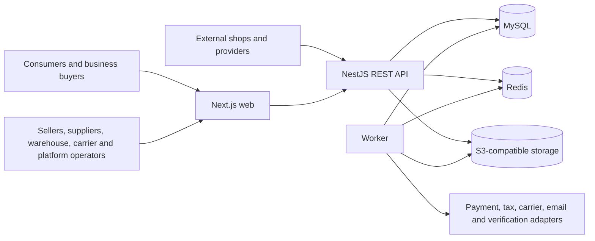

# System context

```mermaid
flowchart LR
  buyers[Consumers and business buyers] --> web[Next.js web]
  operators[Sellers, suppliers, warehouse, carrier and platform operators] --> web
  partners[External shops and providers] --> api[NestJS REST API]
  web --> api
  api --> mysql[(MySQL)]
  api --> redis[(Redis)]
  api --> objects[(S3-compatible storage)]
  worker[Worker] --> mysql
  worker --> redis
  worker --> objects
  worker --> providers[Payment, tax, carrier, email and verification adapters]
```

The reverse proxy is the public ingress. Tenant context is resolved from a
verified host, authenticated principal, or scoped credential—not a normal body field.
