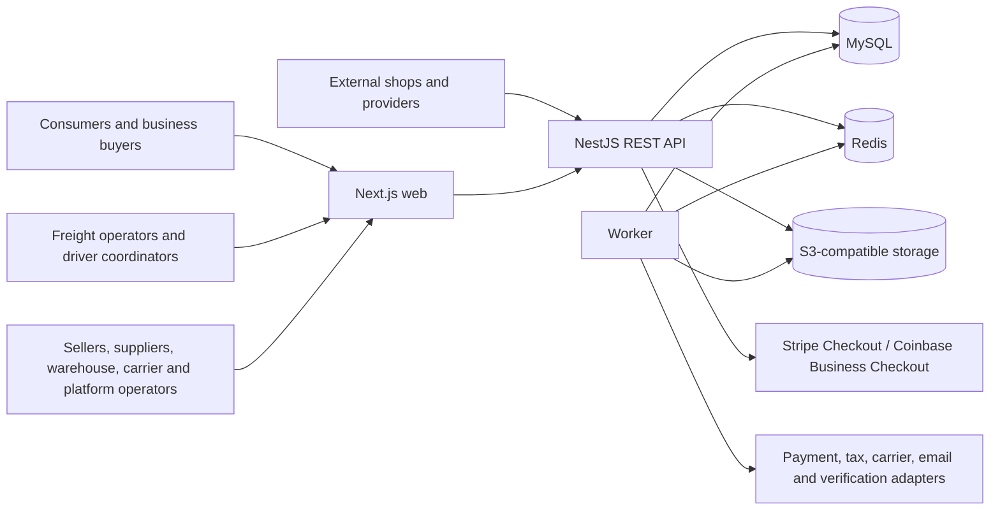

# System context

The reverse proxy is the public ingress. Tenant context is resolved from a
verified host, authenticated principal, or scoped credential—not a normal body field.

Authenticated consumers and business users submit freight requests and follow
quotes, invoices, hosted payment, and booking milestones. Road coordinators
record reported locations manually; sea, air, and rail events are
operator/provider milestones. No driver application or live GPS provider is
part of the current context.
