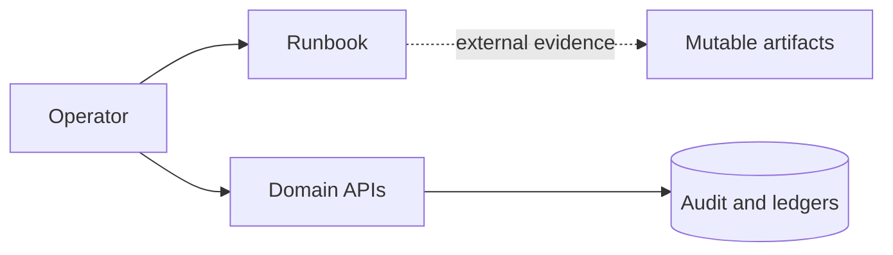
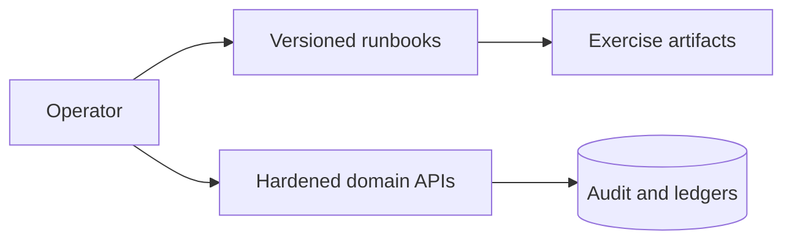
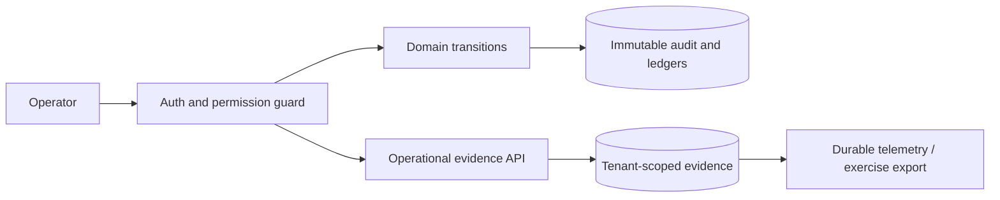

# Security Hardening Proposal: Govern high-impact transitions and operational evidence

## Decision

Choose how readiness and privileged-action evidence is controlled.

## Executive Recommendation

Option 1, Local runbooks, is low-cost guidance. Option 2, Central evidence
boundary, adds guarded tenant-scoped records while retaining those runbooks. The
user explicitly requested Phase 11 implementation, and I recommend Option 2
under the current modular-monolith constraints.

## Evidence

| Evidence | Finding or document                                                     | What it establishes                                                                                         |
| -------- | ----------------------------------------------------------------------- | ----------------------------------------------------------------------------------------------------------- |
| `E001`   | [Initial threat model](../../threat-model.md)                           | Cross-tenant access, payout abuse, secrets, and privileged insiders require isolation, audit, and approval. |
| `E002`   | [Phase roadmap](../../../product/phase-roadmap.md)                      | Production claims require metrics, recovery, retention, privacy, and security evidence.                     |
| `E003`   | [Implementation plan](../../../development/full-implementation-plan.md) | The delivery contract requires tenant isolation, audit, tests, and operational evidence.                    |

I inspected these documents and the API boundary. Observed: domain repositories
already scope high-impact reads by tenant. Inferred: readiness evidence needs
the same boundary or it can drift away from the action it is meant to prove.

## Current Design And Failure Mode

Before Phase 11, recovery and production controls were described as future
requirements. An operator could follow a runbook, but the platform could not
state which tenant, actor, objective, recovery point, or result the exercise
belonged to. This is an evidence-integrity gap, not proof of an exploit.

## Desired Invariants

- Every high-impact transition is permissioned, tenant-scoped, attributable,
  state-constrained, and non-enumerating across tenants.
- Posted finance, stock, audit, and decision history is compensated, not edited.
- SLO and recovery claims link to an observation or exercise.
- Metrics do not retain secrets, bodies, personal contact data, or query values.

## Constraints And Non-Goals

We keep the modular monolith and do not claim that in-process metrics replace a
durable production telemetry backend. This proposal does not select cloud,
backup, secret-manager, SIEM, or orchestration vendors.

## Before Architecture

The important edge is the dotted one: operational evidence has no application
tenant or permission boundary.

## Options

### Option 1: Local runbooks and focused guards

This option preserves the current runtime shape and adds ingress limits,
security headers, CI scanning, and detailed procedures. Its strongest case is
simplicity. What gives me pause is that procedure completion remains
self-asserted and fragmented. Rollout and rollback are documentation-only.

| Change     | Before           | After                | Security consequence     | Cost                     |
| ---------- | ---------------- | -------------------- | ------------------------ | ------------------------ |
| Procedures | Planned          | Versioned runbooks   | More consistent response | Review and exercise time |
| Ingress    | Baseline headers | Size/time/CSP limits | Narrows common abuse     | Compatibility checks     |

Residual risk remains because artifacts are not tenant-scoped or enforced.

### Option 2: Central tenant-scoped evidence boundary

This option keeps Option 1 and adds guarded records for SLO observations,
recovery exercises, retention, legal holds, privacy requests, and approval or
rollback events. The attractive part is reuse of existing tenant and permission
boundaries. The material cost is more schema and control-plane writes; these are
not on checkout or fulfillment hot paths. Application rollback can leave the
additive tables in place.

| Change             | Before             | After                    | Security consequence                     | Cost                              |
| ------------------ | ------------------ | ------------------------ | ---------------------------------------- | --------------------------------- |
| Evidence ownership | External artifacts | Guarded tenant records   | Enforces attribution and isolation       | Additive schema and APIs          |
| Recovery result    | Narrative          | RPO/RTO-derived status   | Claims become testable                   | Exercise integration              |
| Metrics            | Logs and health    | Bounded route aggregates | Faster detection without payload capture | Cross-replica export still needed |

The residual risk is evidence veracity: external backup and telemetry systems
must attest their own results.

## Comparison

| Dimension   | Option 1                                    | Option 2                                    |
| ----------- | ------------------------------------------- | ------------------------------------------- |
| Security    | Focused protections; evidence drift remains | Enforced isolation and attribution          |
| Performance | Nearly neutral                              | Control-plane database writes               |
| Memory      | Neutral                                     | Bounded route aggregates                    |
| Reliability | Procedure-dependent                         | State-constrained evidence                  |
| Operability | Familiar files                              | Queryable records plus provider integration |
| Migration   | Documentation only                          | Additive schema and permissions             |

## Recommendation

I recommend Option 2 because finance, routing, recovery, and privacy decisions
need the same evidence qualities already required for inventory and audit. If
the platform becomes stateless and evidence is guaranteed by a separate,
attested control plane, that external boundary could become preferable.

## Evidence Coverage And Residual Risk

| Evidence                      | Effect                                               | Residual risk                                                    |
| ----------------------------- | ---------------------------------------------------- | ---------------------------------------------------------------- |
| `E001` — Initial threat model | Mitigates privileged and cross-tenant evidence drift | Compromised privileged actors and false external evidence remain |
| `E002` — Phase roadmap        | Implements recordable control-plane evidence         | Production provider validation remains                           |

## Migration And Rollout

Deploy additive tables and permissions first, then API and UI readers. Canary
the application and compare authorization failures, latency, and database
errors. Roll back the application without dropping evidence tables.

## Validation Plan

Exercise unauthorized and cross-tenant identifiers, illegal state transitions,
balanced journal compensation, deterministic optimization, body-size rejection,
route-metric cardinality, restore RPO/RTO, and privacy evidence completion.

## Implementation Work Packages

- Add guarded domain and operability aggregates.
- Apply ingress size, timeout, CSP, and HSTS policy.
- Add security/container scans, SBOM, runbooks, and automated journeys.
- Export production metrics/traces and execute external restore and incident
  exercises before claiming provider readiness.

## Open Questions

Production telemetry, backup, secret-manager, and orchestration providers remain
to be selected and validated.
